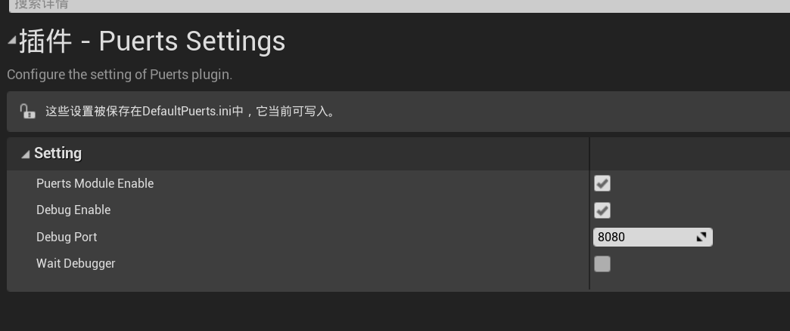

## vscode debug指引

### 自创建虚拟机的调试

* 创建FJsEnv传入调试端口

~~~cpp
//8080是调试端口
GameScript = MakeShared<puerts::FJsEnv>(std::make_unique<puerts::DefaultJSModuleLoader>(TEXT("JavaScript")), std::make_shared<puerts::FDefaultLogger>(), 8080);
~~~

* 阻塞等待调试器链接

~~~cpp
GameScript = MakeShared<puerts::FJsEnv>(std::make_unique<puerts::DefaultJSModuleLoader>(TEXT("JavaScript")), std::make_shared<puerts::FDefaultLogger>(), 8080);
GameScript->WaitDebugger();

//...

GameScript->Start("QuickStart", Arguments);
~~~

### 开启”继承引擎类功能“

开启”继承引擎类功能“后，系统会启动一个默认的虚拟机，该虚拟机通过配置界面来设置调试端口

* 菜单上选择“编辑->项目设置”，打开设置页面后在“插件->Puerts Setting”页面中开启调试以及设置端口

* 勾选WaitDebugger是阻塞等待调试器链接
  - 调试器通过websocket连接，期间有TCP的握手，websocket握手，建立连接后，调试器和V8还会交换些信息，整个过程大概几百毫秒
  - 在这几百毫秒内执行的脚本将无法断点，如果你想断点这些代码，可以用puerts的阻塞等待调试器连接功能

### vscode以及UE编辑器的注意事项

* vscode下打开setting，搜索auto attach，将Debug>Node:Auto Attach设置为“on”（高版本vscode没有该选项，可以不设置）

* 菜单打开“编辑->编辑器偏好设置”页面，在“通用->性能”中把“处于背景中时占用较少CPU”的勾选去掉，否则debug连接会很慢

